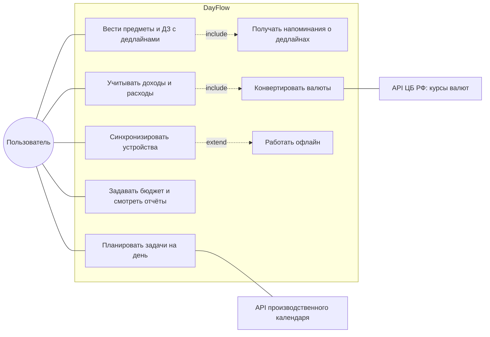
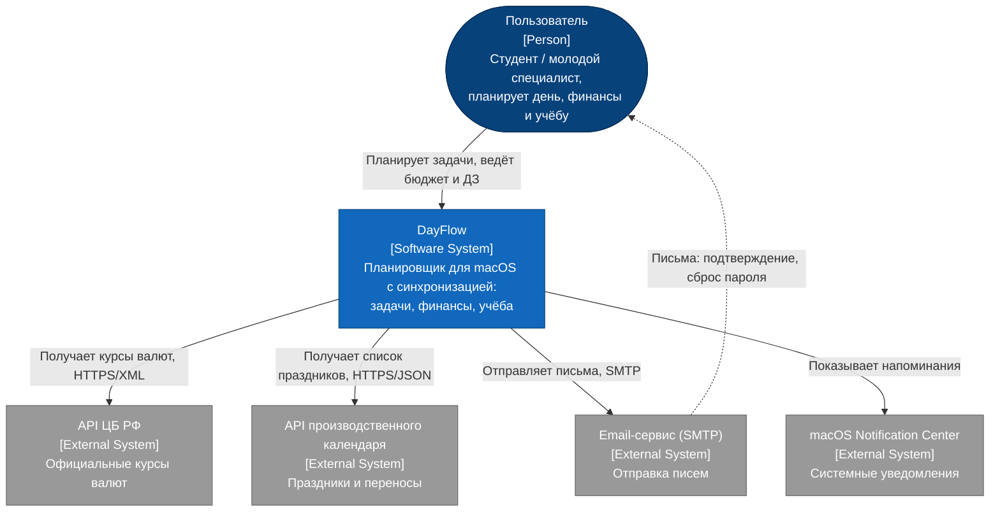
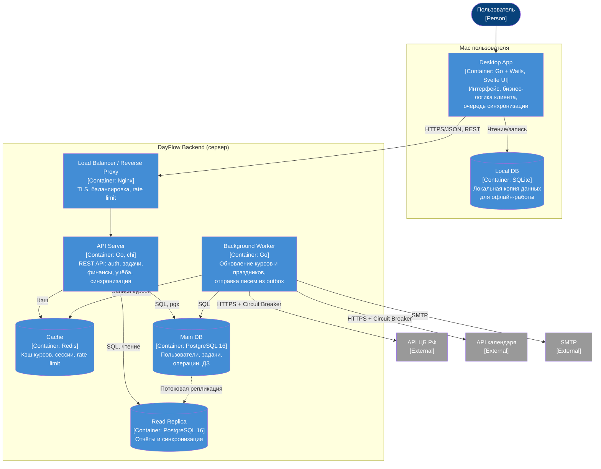
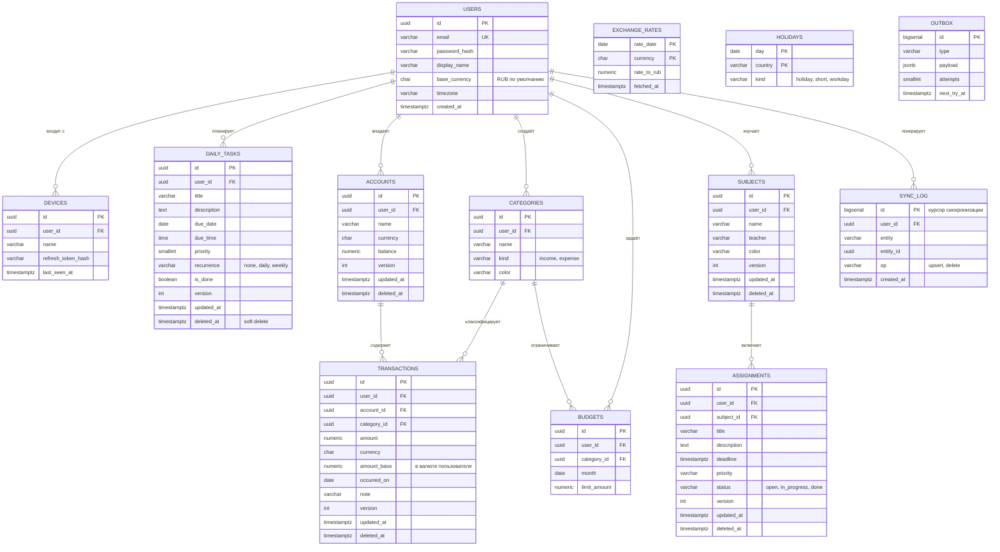
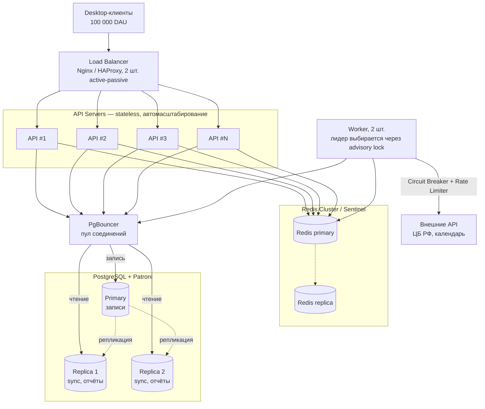

# planer-kpo
 
> Курсовой проект. Стек: **Go** (клиент на Wails + серверный API), **PostgreSQL**, Redis.
> Разделы: планер на день, финансовый планер, учебный планер (предметы, ДЗ, дедлайны).
 
---
 
## Этап 1. Определение проблемы и формулировка темы
 
### Проблема
 
Студенты и молодые специалисты разносят дела, деньги и учебные дедлайны по разным местам: заметкам, мессенджерам, таблицам, банковским приложениям и бумажным ежедневникам. Из-за этого у них нет единой картины дня: они пропускают сроки сдачи домашних заданий, не понимают, куда уходят деньги к концу месяца, и тратят время на постоянное переключение между инструментами. Переносить всё это между несколькими устройствами вручную неудобно, а при потере устройства данные пропадают.
 
### Тема проекта
 
**«Разработка десктопного приложения-планировщика для macOS с синхронизацией данных, объединяющего планирование дня, личных финансов и учебного процесса»**
 
---
 
## Этап 2. Выработка требований
 
### 2.1. Пользовательские сценарии (User Stories)
 
| № | Роль | История | Критерии приёмки |
|---|------|---------|------------------|
| US-1 | Студент | Как студент, я хочу видеть на одном экране задачи на сегодня и ближайшие дедлайны по ДЗ, чтобы за минуту понять, что делать в первую очередь. | Экран «Сегодня» показывает задачи дня и ДЗ со сроком ≤ 3 дней, отсортированные по сроку; загружается < 1 с. |
| US-2 | Студент | Как студент, я хочу заводить предметы и добавлять к ним ДЗ с дедлайном и приоритетом, чтобы не забывать про сдачу работ. | ДЗ привязано к предмету, есть дедлайн, приоритет и статус; за 24 ч и за 3 ч до дедлайна приходит уведомление macOS. |
| US-3 | Пользователь с ограниченным бюджетом | Как пользователь, я хочу записывать доходы и расходы по категориям и задавать лимит на месяц, чтобы не уходить в минус к концу месяца. | Можно добавить операцию за ≤ 3 клика; при превышении 80% лимита категории показывается предупреждение; есть отчёт за месяц по категориям. |
| US-4 | Путешественник / фрилансер | Как пользователь, я хочу вносить траты в разных валютах и видеть итог в рублях, чтобы не пересчитывать вручную. | Суммы конвертируются по курсу ЦБ РФ на дату операции; если курс недоступен, используется последний сохранённый и это явно показано. |
| US-5 | Пользователь с двумя Mac | Как пользователь, я хочу, чтобы данные совпадали на рабочем и домашнем ноутбуке и оставались доступны без интернета, чтобы не зависеть от сети. | Приложение работает офлайн; изменения синхронизируются в течение 5 с после появления сети; конфликты разрешаются без потери данных. |
| US-6 | Студент | Как студент, я хочу, чтобы планер учитывал праздники и переносы выходных, чтобы правильно планировать неделю. | Праздничные дни помечаются в календаре на основе производственного календаря РФ. |
 
Упрощённая диаграмма прецедентов:
 

 
### 2.2. Функциональные требования (кратко)
 
1. Регистрация и вход (email + пароль), JWT-токены, до 5 устройств на аккаунт.
2. **Планер на день:** CRUD задач, дата/время, приоритет, повторение (ежедневно/еженедельно), перенос на другой день.
3. **Финансовый планер:** счета, категории, операции (доход/расход), валюта операции, месячные бюджеты по категориям, отчёт за период.
4. **Учебный планер:** предметы (название, преподаватель, цвет), ДЗ (описание, дедлайн, приоритет, статус), фильтр «горящие дедлайны».
5. Локальные уведомления macOS о дедлайнах и задачах.
6. Офлайн-режим и синхронизация между устройствами.
### 2.3. Масштаб системы
 
Приложение — десктопное, но у него есть серверная часть: синхронизация между устройствами, резервное хранение данных и работа с внешними API (курсы валют, производственный календарь). Нагрузку оцениваем именно для сервера.
 
| Параметр | Значение | Обоснование |
|----------|----------|-------------|
| Уникальных пользователей в сутки (DAU) | **10 000** | Требование задания |
| Зарегистрированных пользователей | ~30 000 | DAU/MAU ≈ 1/3, типично для утилит-планеров |
| Активное время в день | ~60 мин | 3 сессии по ~20 мин (утро, день, вечер) |
| Среднее число одновременных пользователей | 10 000 × 1 ч / 24 ч ≈ **420** | |
| Пиковое число одновременных пользователей | 420 × 4 ≈ **1 700** | Коэффициент пика k = 4 (см. 3.1) |
| Запросов на пользователя в сутки | 120 (100 чтений + 20 записей) | Подробно в 3.1 |
| Запросов в сутки всего | **1 200 000** | |
 
### 2.4. Нефункциональные требования
 
| Требование | Значение |
|------------|----------|
| Доступность серверного API | ≥ 99,5 % в месяц (≤ 3,6 ч простоя) |
| Время отклика CRUD (p95) | ≤ 200 мс |
| Время синхронизации (p95) | ≤ 300 мс |
| Запуск клиента до готовности UI | ≤ 2 с (данные берутся из локальной БД) |
| Хранение данных | не менее 5 лет |
| Безопасность | TLS 1.3, пароли — bcrypt, access-токен JWT 15 мин + refresh-токен 30 дней |
| RPO / RTO | ≤ 5 мин / ≤ 30 мин |
 
### 2.5. Отказоустойчивость (Fault Tolerance)
 
**Внешние зависимости системы:**
 
| Зависимость | Назначение |
|-------------|------------|
| API ЦБ РФ (`cbr.ru/scripts/XML_daily.asp`) | Курсы валют для финансового планера |
| API производственного календаря (например, `isdayoff.ru`) | Праздники и переносы выходных |
| SMTP-сервис | Письма: подтверждение email, сброс пароля |
| Redis | Кэш и rate limiting |
| PostgreSQL | Основное хранилище |
| Серверный API (для клиента) | Синхронизация |
 
**Механизмы:**
 
1. **Кэширование.** Курсы валют кэшируются в Redis (TTL = 1 ч) и дублируются в таблицу `exchange_rates` в PostgreSQL (история по датам). Праздники хранятся в таблице `holidays` на весь год, их запрашивают один раз в сутки.
2. **Circuit Breaker** (библиотека `sony/gobreaker`) на каждом внешнем HTTP-клиенте:
   - **Closed → Open:** 5 ошибок подряд или > 50 % ошибок за 10 с (минимум 10 запросов);
   - **Open:** 30 с запросы не отправляются, сразу берутся данные из кэша/БД;
   - **Half-Open:** 1 пробный запрос; при успехе — Closed, при ошибке — снова Open.
3. **Таймауты и повторы:** таймаут внешнего запроса 2 с, до 2 повторов с экспоненциальной задержкой (200 мс, 400 мс) и jitter.
4. **Outbox-паттерн** для писем: письмо сначала записывается в таблицу `outbox`, воркер отправляет его и повторяет попытки при ошибках.
**Поведение при недоступности зависимостей (деградация функций):**
 
| Что недоступно | Поведение системы | Что видит пользователь |
|----------------|-------------------|------------------------|
| API ЦБ РФ | Circuit Breaker открыт, отдаётся последний курс из Redis → PostgreSQL | Конвертация работает, рядом пометка «курс от 23.09.2026». Если курса нет совсем, суммы показываются в исходной валюте. |
| API календаря | Используются сохранённые данные за год; если их нет — стандартные выходные Сб/Вс | Календарь работает, праздники могут быть не отмечены |
| SMTP | Письма копятся в `outbox`, повтор каждые 5 мин до 24 ч | Письмо приходит с задержкой; остальные функции работают |
| Redis | Запросы идут напрямую в PostgreSQL, rate limiting — in-memory на инстансе | Незаметно (немного растёт latency) |
| PostgreSQL primary | Автоматический failover на реплику (Patroni), ~30 с; в это время API работает в режиме «только чтение» | Изменения сохраняются локально и доезжают после восстановления |
| Весь сервер / нет интернета | Клиент работает с локальной SQLite, изменения копятся в очереди | Полноценная работа офлайн, значок «не синхронизировано» |
 
---
 
## Этап 3. Разработка архитектуры и детальное проектирование
 
### 3.1. Анализ нагрузок (Capacity Planning)
 
#### Профиль запросов одного пользователя в сутки
 
Клиент работает по принципу **local-first**: интерфейс читает из локальной SQLite, а на сервер ходит только за синхронизацией, отчётами и курсами. Поэтому чтений не так много, как в веб-приложении.
 
| Операция | Тип | Кол-во/сутки | Размер ответа | Трафик |
|----------|-----|-------------:|--------------:|-------:|
| Полная синхронизация при запуске | Read | 3 | 50 КБ | 150 КБ |
| Дельта-синхронизация (раз в 2 мин при активной работе) | Read | 30 | 2 КБ | 60 КБ |
| Отчёты, аналитика, списки с сервера | Read | 62 | 4 КБ | 248 КБ |
| Курсы валют | Read | 5 | 1 КБ | 5 КБ |
| **Итого чтений** | | **100** | | **463 КБ** |
| Создание/изменение задач | Write | 10 | 1 КБ запрос + 0,5 КБ ответ | 15 КБ |
| Финансовые операции | Write | 5 | 1 КБ + 0,5 КБ | 7,5 КБ |
| ДЗ и предметы | Write | 5 | 1 КБ + 0,5 КБ | 7,5 КБ |
| **Итого записей** | | **20** | | **30 КБ** |
 
#### Соотношение Read/Write
 
```
Read : Write = 100 : 20 = 5 : 1
```
 
Система преимущественно **читающая**, поэтому для неё полезны кэш и реплики на чтение (см. 3.5).
 
#### RPS
 
```
Всего запросов в сутки = 10 000 × 120 = 1 200 000
Средний RPS            = 1 200 000 / 86 400 ≈ 14 RPS
  чтение               = 1 000 000 / 86 400 ≈ 11,6 RPS
  запись               =   200 000 / 86 400 ≈ 2,3 RPS
```
 
**Пиковый коэффициент.** Около 70 % активности приходится на 6 часов (утро 8–10 и вечер 19–23):
`0,7 × 1 200 000 / (6 × 3 600) ≈ 39 RPS`. С учётом всплесков внутри часа (×1,5) получаем ≈ 58 RPS, то есть **k ≈ 4**.
 
| | Среднее | Пик (×4) |
|--|--:|--:|
| Все запросы | 14 RPS | **~56 RPS** |
| Чтение | 11,6 RPS | ~46 RPS |
| Запись | 2,3 RPS | ~9 RPS |
 
#### Сетевой трафик
 
```
На пользователя: 463 КБ + 30 КБ = 493 КБ
+20 % на HTTP-заголовки и TLS  ≈ 0,59 МБ/сутки
 
Суточный трафик   = 10 000 × 0,59 МБ ≈ 5,9 ГБ/сутки
Месячный трафик   ≈ 5,9 × 30 ≈ 177 ГБ/мес
Средняя полоса    = 5,9 ГБ / 86 400 с ≈ 68 КБ/с ≈ 0,55 Мбит/с
Пиковая полоса    ≈ 0,55 × 4 ≈ 2,2 Мбит/с
```
 
Входящий трафик (записи) — около 4 % от общего, основная нагрузка — исходящая.
 
**Трафик к внешним API благодаря кэшу:**
 
| | Без кэша | С кэшем |
|--|--:|--:|
| Запросы к API ЦБ РФ в сутки | 10 000 × 5 = 50 000 | 24 (раз в час) |
| Запросы к API календаря в сутки | ~30 000 | 1 |
 
#### Дисковая система (хранение ≥ 5 лет)
 
Средний размер строки с учётом служебных полей PostgreSQL (заголовок кортежа 24 байта, выравнивание):
 
| Сущность | Новых записей на пользователя в сутки | Размер строки | Байт/сутки |
|----------|--:|--:|--:|
| `daily_tasks` | 5 | 400 Б | 2 000 |
| `transactions` | 3 | 250 Б | 750 |
| `assignments` | 2 | 500 Б | 1 000 |
| **Итого данные** | | | **3 750 Б** |
| Индексы (+50 %) | | | 1 875 |
| **Итого с индексами** | | | **≈ 5,6 КБ** |
 
```
В сутки:  10 000 × 5,6 КБ     ≈ 56 МБ
В год:    56 МБ × 365         ≈ 20,5 ГБ
За 5 лет: 20,5 ГБ × 5         ≈ 103 ГБ
```
 
Дополнительно:
 
| Компонент | Объём | Расчёт |
|-----------|--:|--------|
| `sync_log` (хранится 30 дней) | ~1,2 ГБ | 10 000 × 20 записей × 200 Б × 30 дней |
| `users`, `devices`, справочники, курсы, праздники | < 0,5 ГБ | 30 000 пользователей × ~1 КБ + история курсов |
| WAL (оперативный) | ~5 ГБ | |
| **Итого на узел БД через 5 лет** | **~110 ГБ** | |
| С запасом 30 % под рост и VACUUM | ~145 ГБ | → **SSD 200 ГБ на узел** |
| Узлов (primary + replica) | 2 | → **400 ГБ SSD** |
| Бэкапы (4 еженедельных полных, сжатие ×0,3 + WAL-архив 30 дней) | ~130 ГБ | 4 × 110 × 0,3 + ~5 ГБ WAL → **хранилище 200 ГБ (S3/NAS)** |
 
Локально на Mac пользователя база SQLite за 5 лет занимает ≈ 5,6 КБ × 1 825 ≈ **10 МБ**.
 
### 3.2. Архитектурные схемы (C4 Model)
 
#### Уровень 1 — System Context
 

 
#### Уровень 2 — Container
 

 
**Почему так:**
- **Wails** позволяет писать клиент на Go и получить нативное `.app`-приложение для macOS (системный WebKit вместо Electron — меньше памяти).
- **API Server не хранит состояние** (stateless), поэтому его легко масштабировать горизонтально.
- **Внешние API вызывает только Worker** — по расписанию, а не по запросу пользователя. Поэтому число обращений к ЦБ не зависит от количества пользователей.
### 3.3. Контракты API
 
Базовый URL: `https://api.dayflow.app/api/v1`. Формат — JSON. Авторизация — `Authorization: Bearer <JWT>` (кроме `/auth/*`). Идентификаторы — UUID, которые **генерирует клиент** (нужно для создания записей офлайн).
 
#### Аутентификация
 
| Метод | Эндпоинт | Описание | p95 | p99 |
|-------|----------|----------|--:|--:|
| POST | `/auth/register` | Регистрация | 300 мс* | 500 мс |
| POST | `/auth/login` | Вход, выдача access + refresh | 300 мс* | 500 мс |
| POST | `/auth/refresh` | Обновление access-токена | 50 мс | 100 мс |
| POST | `/auth/logout` | Отзыв refresh-токена устройства | 50 мс | 100 мс |
 
\* bcrypt намеренно медленный (cost = 12).
 
#### Планер на день
 
| Метод | Эндпоинт | Описание | p95 | p99 |
|-------|----------|----------|--:|--:|
| GET | `/tasks?date=2026-09-24` | Задачи на дату | 100 мс | 200 мс |
| GET | `/tasks?from=…&to=…` | Задачи за период (неделя/месяц) | 150 мс | 300 мс |
| POST | `/tasks` | Создать задачу | 100 мс | 200 мс |
| PATCH | `/tasks/{id}` | Изменить (статус, дата, текст) | 100 мс | 200 мс |
| DELETE | `/tasks/{id}` | Удалить (soft delete) | 100 мс | 200 мс |
 
#### Финансовый планер
 
| Метод | Эндпоинт | Описание | p95 | p99 |
|-------|----------|----------|--:|--:|
| GET | `/finance/accounts` | Список счетов | 100 мс | 200 мс |
| GET | `/finance/categories` | Категории доходов/расходов | 100 мс | 200 мс |
| GET | `/finance/transactions?from=…&to=…&category_id=…&limit=50&cursor=…` | Операции с пагинацией | 150 мс | 300 мс |
| POST | `/finance/transactions` | Добавить операцию | 100 мс | 200 мс |
| PATCH / DELETE | `/finance/transactions/{id}` | Изменить / удалить | 100 мс | 200 мс |
| GET / PUT | `/finance/budgets?month=2026-09` | Бюджеты по категориям на месяц | 150 мс | 300 мс |
| GET | `/finance/summary?month=2026-09&currency=RUB` | Отчёт: итоги по категориям, остаток бюджета | 400 мс | 800 мс |
| GET | `/rates?date=2026-09-24` | Курсы валют к рублю (из кэша) | 30 мс | 80 мс |
 
#### Учебный планер
 
| Метод | Эндпоинт | Описание | p95 | p99 |
|-------|----------|----------|--:|--:|
| GET / POST | `/subjects` | Список / создание предметов | 100 мс | 200 мс |
| PATCH / DELETE | `/subjects/{id}` | Изменение / удаление предмета | 100 мс | 200 мс |
| GET | `/assignments?status=open&due_before=…` | ДЗ с фильтрами (горящие дедлайны) | 150 мс | 300 мс |
| GET | `/subjects/{id}/assignments` | ДЗ по предмету | 100 мс | 200 мс |
| POST | `/assignments` | Создать ДЗ | 100 мс | 200 мс |
| PATCH / DELETE | `/assignments/{id}` | Изменить статус / удалить | 100 мс | 200 мс |
 
#### Синхронизация и справочники
 
| Метод | Эндпоинт | Описание | p95 | p99 |
|-------|----------|----------|--:|--:|
| GET | `/sync?cursor=<bigint>` | Изменения после курсора (дельта) | 300 мс | 600 мс |
| POST | `/sync` | Пакетная отправка офлайн-изменений (до 500 шт.) | 300 мс | 700 мс |
| GET | `/calendar/holidays?year=2026` | Праздники (из БД) | 50 мс | 100 мс |
| GET | `/health` | Проверка работоспособности | 10 мс | 20 мс |
 
#### Пример: создание ДЗ
 
```http
POST /api/v1/assignments
Authorization: Bearer eyJhbGciOi...
Idempotency-Key: 7f1c2a9e-4b1d-4e0a-9c55-0f3c1d2b7a11
Content-Type: application/json
 
{
  "id": "0d6f0b8e-2a44-4c5e-9a53-1c2d3e4f5a6b",
  "subject_id": "a1b2c3d4-0000-4000-8000-000000000001",
  "title": "Лабораторная №3: индексы в PostgreSQL",
  "description": "Сравнить B-tree и GIN",
  "deadline": "2026-10-01T23:59:00+03:00",
  "priority": "high",
  "status": "open"
}
```
 
```http
HTTP/1.1 201 Created
{
  "id": "0d6f0b8e-2a44-4c5e-9a53-1c2d3e4f5a6b",
  "version": 1,
  "updated_at": "2026-09-24T12:30:05Z"
}
```
 
#### Пример: дельта-синхронизация
 
```http
GET /api/v1/sync?cursor=184223
```
 
```json
{
  "changes": [
    { "entity": "task", "op": "upsert", "id": "…", "version": 3, "data": { "title": "Спортзал", "done": true } },
    { "entity": "transaction", "op": "delete", "id": "…", "version": 2 }
  ],
  "next_cursor": 184257,
  "has_more": false
}
```
 
**Коды ошибок:** `400` — ошибка валидации, `401` — нет/просрочен токен, `404` — не найдено, `409` — конфликт версий (клиент прислал устаревшую `version`), `429` — превышен лимит (100 запросов/мин на пользователя), `503` — сервис в режиме «только чтение» (failover).
 
**Общие нефункциональные требования к API:** доступность 99,5 %, доля ошибок 5xx < 0,1 %, все записывающие запросы идемпотентны (заголовок `Idempotency-Key`), максимальный размер тела запроса — 1 МБ.
 
### 3.4. Проектирование данных
 
#### ER-диаграмма
 

 
#### Индексы
 
```sql
-- Планер на день: «задачи на дату / за неделю»
CREATE INDEX idx_tasks_user_date
    ON daily_tasks (user_id, due_date)
    WHERE deleted_at IS NULL;
 
-- Финансы: лента операций и отчёт за месяц
CREATE INDEX idx_tx_user_date
    ON transactions (user_id, occurred_on DESC)
    INCLUDE (category_id, amount_base)
    WHERE deleted_at IS NULL;
 
-- Учёба: горящие дедлайны (только незакрытые ДЗ)
CREATE INDEX idx_assign_user_deadline_open
    ON assignments (user_id, deadline)
    WHERE status <> 'done' AND deleted_at IS NULL;
 
CREATE INDEX idx_assign_subject ON assignments (subject_id);
 
-- Синхронизация: выборка изменений после курсора
CREATE INDEX idx_sync_user_cursor ON sync_log (user_id, id);
 
-- Бюджет: одна запись на категорию в месяц
CREATE UNIQUE INDEX uq_budget ON budgets (user_id, category_id, month);
```
 
#### Обоснование: почему структура и индексы выдержат нагрузку
 
1. **Объём таблиц через 5 лет** (10 000 DAU × 1 825 дней):
   - `daily_tasks`: 5 × 10 000 × 1 825 ≈ **91 млн строк**;
   - `transactions`: 3 × 10 000 × 1 825 ≈ **55 млн строк**;
   - `assignments`: 2 × 10 000 × 1 825 ≈ **37 млн строк**.
   Для B-tree индекса на 100 млн записей глубина дерева — 4 уровня, поэтому поиск по `(user_id, дата)` занимает несколько чтений страниц (≈ 1 мс), независимо от общего размера таблицы.
2. **Почти все запросы выполняются в рамках одного пользователя.** `user_id` стоит первым в каждом составном индексе, так что запрос затрагивает только данные этого пользователя (в среднем ~9 000 задач за 5 лет), а не всю таблицу.
3. **Частичные индексы** (`WHERE status <> 'done'`, `WHERE deleted_at IS NULL`) исключают закрытые и удалённые записи. Индекс «горящих дедлайнов» остаётся маленьким: в нём только актуальные ДЗ.
4. **Покрывающий индекс** (`INCLUDE (category_id, amount_base)`) позволяет построить месячный отчёт через Index Only Scan, не обращаясь к самой таблице.
5. **`amount_base` хранится при записи** (конвертация по курсу на дату операции), поэтому отчёты не пересчитывают валюты на каждый запрос.
6. **Нагрузка на запись — около 9 RPS в пике.** PostgreSQL на одном узле выдерживает тысячи вставок в секунду, запас — больше двух порядков. Каждая вставка обновляет 2–3 индекса, это допустимо.
7. **Чтения — около 46 RPS в пике.** Это Index Scan по ~1 мс, горячие данные помещаются в `shared_buffers` (≈ 25 % RAM сервера с 16 ГБ = 4 ГБ).
8. **UUID, созданные на клиенте,** позволяют создавать записи офлайн без конфликтов идентификаторов. `version` нужен для оптимистичной блокировки и обнаружения конфликтов синхронизации. `sync_log.id` (bigserial) служит монотонным курсором для дельта-синхронизации.
9. **Рост `sync_log`** ограничен: записи старше 30 дней удаляются ежедневной задачей. Клиент, который не выходил в сеть дольше 30 дней, выполняет полную синхронизацию.
### 3.5. Масштабирование (×10: до 100 000 пользователей в сутки)
 
#### Нагрузка после роста
 
| Параметр | 10 000 DAU | 100 000 DAU |
|----------|--:|--:|
| Пиковый RPS (всего) | ~56 | **~560** |
| Пиковый RPS чтения / записи | 46 / 9 | 460 / 93 |
| Одновременных пользователей (пик) | ~1 700 | ~17 000 |
| Трафик в сутки | 5,9 ГБ | 59 ГБ |
| Пиковая полоса | 2,2 Мбит/с | 22 Мбит/с |
| Данные за 5 лет | ~110 ГБ | **~1,1 ТБ** |
| Запросы к API ЦБ РФ в сутки | 24 | **24** (не меняется) |
 
#### Схема после масштабирования
 

 
#### Стратегия масштабирования
 
1. **Горизонтальное масштабирование API.** API-сервер не хранит состояние, поэтому инстансы добавляются за балансировщиком. Один инстанс на Go (2 vCPU) обрабатывает ~300–500 RPS простого CRUD, для 560 RPS в пике достаточно 3–4 инстансов с запасом на отказ одного из них (N+1).
2. **Разделение чтения и записи.** При соотношении Read:Write = 5:1 чтения (синхронизация, отчёты, списки) уходят на 2 реплики, записи — на primary. Небольшая задержка репликации (< 1 с) допустима, потому что клиент и так хранит свои изменения локально.
3. **PgBouncer** (transaction pooling): 4 инстанса × 50 соединений превращаются в ~100 реальных соединений с PostgreSQL вместо сотен.
4. **Партиционирование таблиц.** `transactions`, `daily_tasks` и `assignments` делятся по хешу `user_id` (например, 16 партиций). Индексы становятся меньше, VACUUM работает быстрее. Следующий шаг при дальнейшем росте — шардирование по `user_id`: данные пользователя целиком лежат на одном шарде, так как межпользовательских запросов нет.
5. **Кэширование ответов в Redis:** месячные отчёты `/finance/summary` (TTL 5 мин, сбрасывается при записи операции пользователя), праздники, курсы валют.
6. **Хранилище:** 1,1 ТБ за 5 лет → SSD 2 ТБ на узел. Операции старше 2 лет можно переносить в архивные партиции на более дешёвый диск.
#### Кэширование внешних запросов (защита от блокировки внешним API)
 
Цель — чтобы число обращений к API ЦБ РФ и календаря **не зависело от числа пользователей**: клиенты никогда не обращаются к внешним API напрямую.
 
| Механизм | Реализация | Эффект |
|----------|------------|--------|
| **Опережающее обновление (refresh-ahead)** | Worker по расписанию (cron): курсы — раз в час, праздники — раз в сутки. Записывает в Redis и PostgreSQL. | Пользовательский запрос всегда попадает в кэш, к ЦБ — 24 запроса в сутки при любом числе пользователей |
| **Двухуровневый кэш** | L1 — in-memory в API-инстансе (TTL 1 мин), L2 — Redis (TTL 1 ч), L3 — таблица `exchange_rates` (история навсегда) | Redis разгружен, при его отказе данные есть в БД |
| **Stale-while-revalidate** | Если TTL истёк, сразу отдаются старые данные, а обновление запускается в фоне | Нет ожидания внешнего API в пользовательском запросе |
| **Защита от «лавины» (cache stampede)** | `golang.org/x/sync/singleflight` + распределённый lock в Redis (`SET NX EX 30`) | При промахе кэша во внешний API идёт один запрос, а не 1 000 |
| **Rate Limiter исходящих запросов** | Token bucket (`golang.org/x/time/rate`): не больше 1 запроса/с к каждому внешнему API | Исключает блокировку по IP даже при ошибке в коде |
| **Circuit Breaker** | `sony/gobreaker` (параметры в 2.5) | Не долбим упавший сервис, отдаём кэш |
| **Единственный лидер-воркер** | `pg_try_advisory_lock` — внешние API опрашивает только один из воркеров | При масштабировании воркеров число внешних запросов не растёт |
| **Исторические курсы** | Курс за прошедшую дату не меняется, поэтому кэшируется бессрочно | Отчёты за прошлые месяцы вообще не требуют внешних вызовов |
 
```go
// Упрощённый пример получения курса с кэшем и защитой от лавины
func (s *RateService) Get(ctx context.Context, date time.Time) (Rates, error) {
    key := "rates:" + date.Format("2006-01-02")
    if r, ok := s.redis.Get(ctx, key); ok {
        return r, nil
    }
    v, err, _ := s.sf.Do(key, func() (any, error) {
        // сначала своя БД, во внешний API — только через breaker + limiter
        if r, err := s.repo.Find(ctx, date); err == nil {
            return r, nil
        }
        return s.breaker.Execute(func() (any, error) {
            if err := s.limiter.Wait(ctx); err != nil {
                return nil, err
            }
            return s.cbr.Fetch(ctx, date)
        })
    })
    if err != nil {
        return s.repo.FindLatestBefore(ctx, date) // деградация: последний известный курс
    }
    r := v.(Rates)
    s.redis.Set(ctx, key, r, time.Hour)
    return r, nil
}
```
 
---
 
## Технологический стек
 
| Слой | Технология |
|------|------------|
| Desktop-клиент | Go 1.23, Wails v2, Svelte, SQLite (`modernc.org/sqlite`) |
| Backend API | Go 1.23, `go-chi/chi`, `jackc/pgx/v5`, `golang-jwt/jwt` |
| Надёжность | `sony/gobreaker`, `x/sync/singleflight`, `x/time/rate` |
| Хранилища | PostgreSQL 16 + Patroni, PgBouncer, Redis 7 |
| Инфраструктура | Docker Compose (разработка), Nginx, Prometheus + Grafana |
| Миграции | `golang-migrate` |
 


